# Interval Analysis and its Applications to Optimization in Behavioural Ecology

Interval Analysis is a means of representing uncertainty by replacing single (fixed-point) values with intervals. In this project, interval analysis is applied to a foraging model in behavioural ecology. The model describes an individual foraging in a collection of continuously renewing resource patches. This model is used to determine the optimal residence time of the forager in a resource patch assuming the forager wants to maximize its rate of resource intake. Before applying interval analysis, fixed-point (non-interval) optimization will be done to serve as a basis. Certain parameters in the mode will then be replaced with intervals and interval-based optimization conducted.

See <https://justintung.com/community/interval-analysis-and-its-applications-to-optimization-in-behavioural-ecology/> for details.

This directory contains Matlab files for the model and the full report is below. 

## Interval Analysis and its Applications to Optimization in Behavioural Ecology

by Justin Tung

Cornell University Computer Science (CS) 490 Independent Research Report

**Instructor: David Schwartz**

**Date: December 19, 2001**

**Table of Contents**

**Abstract **

**1. Introduction**

1.1 Interval Analysis

1.1.1 Basics and Notation 

1.1.2 Uncertainty and Approximating Values 

1.1.3 Interval Arithmetic and Functions

1.2 Foraging Theory 

1.2.1 Basics of Foraging Models 

1.2.2 Simplistic Analytic Foraging Model 

1.2.3 The Optimal Residence Time   

**2. Research Problem and Methods**

2.1 Motivation 

2.1.1 Problems with Fixed Point Optimization in Foraging Models 

2.1.2 Interval Analysis as Uncertainty in Method 

2.1.3 Research Problem 

2.1.4 Software 

2.2 Methodology 

2.2.1 Fixed-Point Analysis 

2.2.1.1 General Method 

2.2.1.2 Algorithm: Bisection Method 

2.2.2 Interval Analysis 

2.2.2.1 General Method 

2.2.2.2 Algorithm: Interval Newton's Method 

2.2.2.3 Variation and Constraints on Parameters 

**3\. Numerical Analysis of Model ** 

3.1 Fixed Point Analysis 

3.1.1 Graphical Analysis 

3.1.2 Optimization and Analysis 

3.2 Interval Analysis 

3.2.1 True Solutions and Interval Optimization  

3.2.2 Stability Analysis 

**4. Conclusions and Future Exploration** 

4.1 Results of Numerical Study  

4.1.1 Comparison of Fixed Point and Interval Roots 

4.1.2 Applications to Foraging Model 

4.2 Future Exploration 

**Bibliography** 

**\
**

### Abstract

Interval Analysis is a means of representing uncertainty by replacing single (fixed-point) values with intervals. In this project, interval analysis is applied to a foraging model in behavioural ecology. The model describes an individual foraging in a collection of continuously renewing resource patches. This model is used to determine the optimal residence time of the forager in a resource patch assuming the forager wants to maximize its rate of resource intake. Before applying interval analysis, fixed-point (non-interval) optimization will be done to serve as a basis. Certain parameters in the model will then be replaced with intervals and interval-based optimization conducted. A comparison of the interval and fixed-point results will be done as well as analysis of parameter intervals and their constraints, root approximations, and applications to the model.

### Chapter 1: Introduction

**1.1 Interval Analysis**

**1.1.1 Basics and Notation**

 This paper will explain only the basics of **Interval Analysis** (IA) needed to understand the topics covered and assumes some prior knowledge of IA and Matlab (see 2.1.4 regarding Matlab). For a formal mathematical introduction and in depth coverage of concepts see Schwartz (1999) or Moore (1966) listed in the references. Interval analysis was initially developed in the late 1960's to bound computational error and it is a deterministic way of representing uncertainty in values by replacing a number with a range of values (Schwartz 17). Fixed-point analysis is simply analysis using non-interval values where there is no uncertainty in the values. As a result, IA uncertainty concepts can be used to model varying biological parameters in the ecological model to be explored in section 1.2 and also to frame fixed-point results.

IA's mathematical definitions and notations are extended from set theory and ordered numerical sets called intervals (Schwartz 30). This paper considers closed interval analysis with the following definitions of an **interval** (using Matlab upper bound, lower bound style notation):

inf(x) -- denotes the infinum, or lower bound of **x**

sup(x) -- denotes the supremum or upper bound of **x**

**1.1.2 Uncertainty and Approximating Values**

There are a several useful quantities related to the concept of the interval: size, radius, and midpoint. The size (or thickness) of an interval indicates the uncertainty in a value and is specified as a width: w(**x**) = sup**(x) -** inf(**x**) (Schwartz 32-33). Intervals with zero thickness are crisp intervals whereas non-crisp intervals said to be thick. The concepts of radius and midpoint are useful in describing intervals as well as constructing them. The radius and midpoint are defined as (Schwartz 33):

rad(**x**) = w(**x**)/2

 mid(**x**) = (sup(**x**) + inf(**x**))/2

To construct a new interval, one way is to use an original value, which is a value that supplies the midpoint point of a new interval. Then, a certain radius (uncertainty) can be added to and subtracted from the original value to obtain a new interval (Schwartz 35). Similarly, the midpoint can also serve as an approximation to a value with an error of plus or minus the radius. Using these definitions, the percentage uncertainty in a midpoint value would be: p = 100*rad(**x**)/mid(**x**) (Schwartz 148).

**1.1.3 Interval Arithmetic and Functions**

 The results and properties of interval arithmetic will be omitted for this section; however, I recommend referring to Schwartz (1999) to understand the basics of interval arithmetic. The fundamental principles in interval operations are independence and extremes. Independence means numerical values vary independently between intervals and extremes means interval operations generate the widest possible bounds given the ranges of values (Schwartz 37-38). Interval-valued functions follow from interval arithmetic of which there are two types: interval extensions and united extensions (or true solution sets). Interval extensions are functions where interval arithmetic is applied to calculate results. United extensions are more computationally intensive and involve calculating fixed-point results with all possible combinations of variable interval endpoints. The disadvantage of the interval extensions is that they can over expand the true solution sets of a function (Schwartz 45-49). This quality of interval extensions is unfortunate since both types of extensions guarantee containment of all possible numerical results of the function given the inputs. Also, both extensions satisfy a property called inclusion monotonicity (given inputs, an extension generates the widest possible bounds), which is similar to the extremes principle of interval arithmetic (Schwartz 56).

**1.2 Foraging Theory**

**1.2.1 Basics of Foraging Models**

 Foraging models in general study two basic problems of a forager: which food/prey items to consume and when to leave an area containing food (a resource patch). This paper will concentrate on the latter as an optimization problem. Before going into details of the model, it is important to understand the framework of foraging models. Stephens and Krebs point out that foraging and optimality models have three main components, decision, currency, and constraint assumptions (5). Decision assumptions determine which problems (or choices) of the forager are to be analyzed and these choices are usually expressed as variables. The optimization problem comes from assuming behaviour and evolutionary mechanisms optimize the outcome of a forager's choices. Currency assumptions provide means of evaluating choices. These choices usually involve maximization, minimization, or stability of a situation. Choice evaluation is embodied in the currency function (a real valued function), which takes the decision variables and evaluates their outcome into a single value. Constraint assumptions are limitations to the model and relate decision variables with the currency. Limitations can be generalized to 2 types, extrinsic (environment limits on animal) and intrinsic (animal's own limitations). Also, there are three general constraint assumptions (also assumed by the model in section 1.2.2) for conventional foraging models:

1) Exclusivity of search and exploitation -- the predator can only consume or search for patches/prey and not perform both actions are the same time

2) Sequential Poisson encounters -- items (prey or patches) are encountered one at a time and there is a constant probability regarding prey/patch meetings in a short time period

3) Complete information -- the forager behaves as if it knows the rules of the model

These three concepts of decision, currency, and constraint provide means of optimization given choices, how to determine their success, and limitations (Stephens and Krebs 6-11).

**1.2.2 Simplistic Analytic Foraging Model**

 Given the structure of a foraging model, it is easy to frame a model examining the foraging of a single animal over a collection of distinct resource patches. I have taken the model along with its decision, currency, and constraint assumptions from Wilson (2000) so derivations of the model's equations, its origins, and an analysis and extensions of the model in C can be found in his book. The rules of the forager in the model are that the animal stays for a fixed time before moving to a new resource patch, time is discrete, and patch resource values (biomass, energy, etc) grow logistically. The decision assumption lies in the determination of the fixed time value. The currency function allows us to optimize the animal's situation given this fixed time and also allows us to apply constraints to the model (Wilson 152). Despite its name, the simplistic analytic foraging model actually characterizes foraging simulation results well using the model's specifications. Here is a list of parameters taken in by the model:

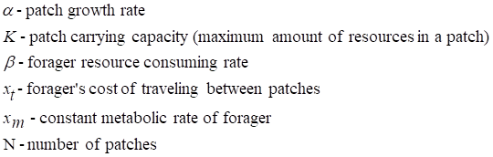

To derive the model, we can start analyzing the resource side assuming that the ith patch without the forager consuming grows logistically:

 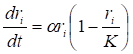

Where t is time and r~i~ is the amount of resources in the ith patch. If a forager enters a given patch f, resource dynamics can be modeled as follows:

 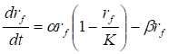

In the fth patch, the consumer decreases the rate of growth by a factor related to beta, the consuming rate. To model overall patch growth, average patch growth for N-1 identical patches is added to the patch growth (or decay) of the fth patch:

 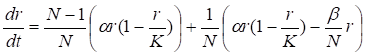

 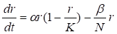

To achieve an equilibrium resource density r*, we set dr/dt = 0 and solve for r yielding:

 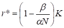

A quick analysis of the limit as N approaches infinity shows that the forager's effect is insignificant at equilibrium since the term containing beta goes to zero and r* goes to K as expected (Wilson 153-154). The resource side provides us with an environment and extrinsic constraints that will affect the currency function which lies on the forager side of the model. Key to resource exploitation models is the gain function, g(t). The gain function specifies the amount consumed from a resource patch given time t. Assuming the forager lands on a resource patch always in equilibrium r*, g(t) is the time integral of its instantaneous consumption rate minus its metabolic costs. Metabolic costs represent intrinsic constraints since the animal must "pay" these costs when foraging.

 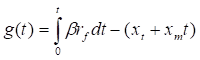

The x~t~ and x~m~ constraints act as intrinsic limitations on the model since the traveling costs prevents the forager from moving quickly from patch to patch and skimming resources, while the metabolic cost causes the forager to gather resources for threat of death. In order to evaluate g(t), we require an analytical solution to r~f~, which measures the resources in the patch the forager is in. Solving the first order differential equation from the resource side derivations for r~f~ using separation of variables yields:

 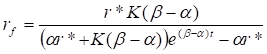

Then substituting this equation into g(t) and solving the integral we get:

 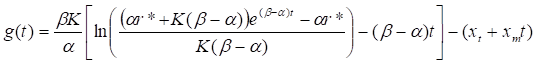

Using this gain function, the crucial equation from the forager perspective, the net foraging rate function can be calculated as:

 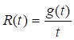

R(t) is the currency function for our model since it is the basis of choice evaluation and optimization for the model (Wilson 154-155). It also combines the decision variables and constraints into one value and will be a basis for graphical analysis later on.

**1.2.3 The Optimal Residence Time**

 Assuming behavioural and evolutionary mechanisms drive foragers to optimize the time spent on each patch. This assumption implies that they will stay long enough to optimize the rate of resource consumption, r(t). Mathematically, this choice implies the maximization of r(t):

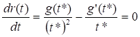

where t* is called the optimal residence time. For rate maximization, r''(t*) < 0 must also be checked; however, assuming r(t*) is at a maximum, we obtain the equation:

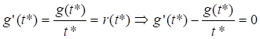

which relates r(t) to the derivative of the gain function. The second function above is the function to be used for root finding. Essentially, the optimal time to leave a patch is when the expected rate of resource return decreases to the average rate of return of a new patch. This result, which is a statement of the marginal value theorem for foraging, is a reasonable estimation of animal behaviour considering a forager's desire to maximize on its resource intake (Wilson 156-157). One problem in optimization problems is figuring out whether an optimal point exists and in this case, we must be sure r''(t*) < 0 and be sure such a t* exists. Unfortunately, due to the complexity of g(t) is it not possible to solve for an explicit solution of t* so to justify existence of a solution, we turn to theoretical justifications and, later in section 3.1.1, graphical means. Due to the conditions specified in foraging models, gain functions are "well-defined, continuous, deterministic, and negatively accelerated" functions (Stephens and Krebs 25-26). This outcome results from assuming patch resources are sufficient (i.e. the equilibrium resource is sufficiently large) enough that, when the forager enters a patch, r(t) will reach a maximum and then decrease until the gain function reaches an asymptotic maximum when further time spent in the resource patch does not yield significantly more gain in resources. The reason for the gain function's properties is the assumption that patches contain a finite number of resources and foraging depletes them. This assumption; however, relies on the assumptions about residence time, foraging rates, and resource patch dynamics in general (Stephens and Krebs 25-26). Due to the simple nature of the model, these gain function properties hold so r(t) does reach a maximum at t* and r''(*t) < 0.

### Chapter 2: Research Problems and Methods

**2.1 Motivation**

**2.1.1 Problems with Fixed Point Optimization in Foraging Models**

 Stephens and Krebs (1986) discuss various limitations and criticisms of behavioural ecology optimality models. One criticism has to do with "static versus dynamic" modeling since basic foraging models often do not take the animal's state into account (i.e. whether an animal is starving or fully rested and fed) (Stephens and Krebs 34). Also, a problem that occurs during testing phases of a model is when it breaks down. At that point, the ecologist must re-analyze the model to find what is incorrect, often checking constraints (Stephens and Krebs 208)

**2.1.2 Interval Analysis as an Uncertainty Method**

 IA can address but not completely solve the problems stated above. One of the strengths of IA is its ability to evaluate a whole range of values in one calculation that would take an infinite number of fixed-point calculations to produce. As a result, IA could simulate the presence of multiple states of an animal and/or its environment by placing uncertainty in the model's parameters. This method provides easy deterministic implementation of multiple state models and produces ranges of values for evaluation. This method partially addresses the second problem of when a model breaks down. A model could break down due to incorrect assumptions about constant forager or environment states. Another application of IA to testing is that IA is numerically superior when it comes to testing different acceptable uncertainties in values could help identify problems in the model or unrealistic assumptions.

**2.1.3 Research Problem**

 The purpose of this paper is to introduce IA methods to the simplistic analytic foraging model and calculate interval optimal residence times for interval parameters. At same time, solving the fixed point optimal residence time will provide framework from which to analyze the interval results. The optimization will be done for patch sizes N = 3, 5, 10, and 20. The parameters with uncertainty will be:

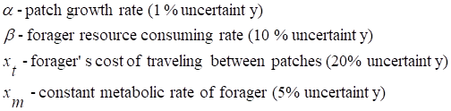

These uncertainties could be strengthened with fieldwork studies; however, for simplicity they are determined a priori. After computing interval optimal residence times, the intervals and their fixed-point approximations will be compared to the fixed-point optimal times to compare algorithms and to analyze the functions' behaviour under both methods. On a more theoretical side, stability analysis of the model will be conducted. This analysis involves varying one uncertain parameter, while holding the others constant until the model fails. Therefore, stability analysis is used to see performance of the model under parameter uncertainty perturbations. Conditions for failure will be specified in section 2.2.2.3.

**2.1.4 Software**

 The language to be used is Matlab version 5.3 with an add-on toolbox called INTLAB programmed by Siegfried Rump (2001). Refer to the references for documentation on the INTLAB toolbox. For this paper, the INTLAB toolbox is used to provide interval data structures, implementation of interval arithmetic and interval-valued functions, as well as basic functions for radius, midpoint, and intersection interval functions in Matlab.

**2.2 Methodology**


**2.2.1 Fixed-Point Analysis**

**2.2.1.1 General Method**

 Rootfunc(t) specified below is the function whose root we are seeking:

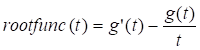

Since rootfunc(t) has relatively cheap function evaluations it is useful to perform a "graphical search" for the root (Van Loan 294). This procedure involves plotting the function in the time interval of interest and examining its roots. In addition to this function, during the fixed-point analysis, we will also plot r(t) to search for the existence of maximums as well as rootfunc''(t) to confirm that rootfunc''(t) is indeed negative in the interval of interest. Although, graphical searches are rather trivial, they provide a large amount of information confirming theoretical conclusions in section 1.2 as well as enabling a pictorial view of the objective and related functions. Another use of the plotting of functions before optimization is to use the plots to generate starting intervals for iterations of root finding methods. In order to plot rootfunc, r(t), and r''(t) it is necessary to implement equations for g(t), g'(t), and r''(t). The details for calculating g'(t) and r''(t) are left out since g(t) is a rather messy function, but the derivatives are implemented in the Matlab code for section 3.1.1. Assuming the properties of the gain function discussed in 1.2.3, which will be confirmed in section 3.1.1, it is necessary to choose an algorithm that will produce a root given the conditions of rootfunc(t).

**2.2.1.2 Algorithm: Bisection Method**

 Since rootfunc(t) is continuous and changes sign within the interval of interest, the bisection method can be used. This method involves calculating a sequence of smaller and smaller intervals that bracket (contain) the root of rootfunc(t). The main algorithm proceeds as follows (if rootfunct(t) = f(t)) given a bracketing interval [a,b]:

 assume f(a)f(b) 0 and let m = (a+b)/2

 either f(a)f(m) 0 or f(m)f(b) 0

 in the first case we know the root is in [a,m] else it is it [m,b]

In either situation, the search interval is halved and this process can be continued until a small enough interval is obtained. Since the search interval is halved with each iteration, the bisection method exhibits O(n) convergence. The only tricky points are to optimize the method so that only one function evaluation is required per iteration after the first and to establish a safe convergence criterion so that the tolerance interval is not smaller than the gap in the floating point numbers between a and b. Van Loan provides the core of the code for the bisection method with slight modifications to fit the parameters of the model (280). Although the bisection method does not experience O(n^2) convergence like the Newton method, rootfunc(t) is simple enough that it converges quickly for practical purposes. Also, it is simple (algorithmically and doesn't require rootfunc'(t) implementation) and translates well into the idea of searching using a starting interval [a,b], which we will use later in the interval root finding.

**2.2.2 Interval Analysis**

**2.2.2.1 General Method**

 When changing from fixed-point to interval based root finding there are some immediate differences. The root is no longer a crisp interval since iterations using an interval-valued function produce intervals. As a result, convergence criterions and the general methods of root finding must have a set valued approach. Because the optimal residence times will inherently be thick intervals since the rootfunc(**t**) is now an interval function with uncertain parameters, convergence will be solved simple by setting a maximum number of iterations. The reason this convergence guarantees an enclosure of the root is due to the Interval Newton method, which is based on the fixed-point one.

**2.2.2.2 Interval Newton Method**

For details of the math and convergence properties of the algorithm, refer to Kulisch et al. (2001). This algorithm, when finding roots of fixed-point functions exhibits O(n^2) convergence. Like the Bisection Method, it requires a bracketing interval to begin and with each iteration generates smaller and smaller intervals (if possible), which are bounded by intersections with previous iterations. The algorithm is as follows:

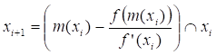

where the **x**'s are intervals, m(**x**) is the midpoint of a the interval **x,** and f is the function whose root we seek (Kulisch et al. 35-36). The similarity of this algorithm to the fixed-point Newton method is that a starting interval must be supplied and the interval size is decreased using a f(**x**)/f'(**x**) term during iterations. This algorithm is almost as simple as the bisection method since an easy convergence criterion has been specified; however, the interval Newton requires implementation of rootfunc'(t) and requires 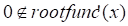 for an evaluated interval **x**. Through computational trials, I have decided to increase the complexity of the function evaluations for the f(**x**)/f'(**x**) by computing its united extension instead of a interval extension. Since both f(**x**) and f'(**x**) involve many interval arithmetic calculations in an interval extension, the values are over expanded from their true solution set and in computing optimal residence times we are interested in finding tight bounds on the root given model uncertainties. As a result, the interval Newton step is calculated by finding the minimums and maximums of f(**x**) and f'(**x**) given all the combinations of the endpoints of the parameters and the time interval and producing united extension values for both quantities.

**2.2.2.3 Variation and Constraints on Parameters**

 As outlined in 2.1.3, percent uncertainties in the alpha, beta, x~t~, and x~m~ parameters will be added when analyzing the model using interval root finding. This variation of parameters serves to address the problems with fixed-point optimization outlined in 2.1.1. The potential use for interval parameters lies in model testing, simulating a range of environment and forager states, and relaxation of constraints. Besides replacing parameters with intervals, we also want to conduct the stability analysis mentioned in 2.1.3. This process involves increasing uncertainties of a given parameter while keeping all other parameters constant until the model fails. After specifying the interval Newton algorithm we can construct a failure condition. Failure of the model can be considered to occur when the interval Newton method returns of the initial interval supplied to the interval root finder as the optimal time interval for any N number of patches (i.e. the algorithm was unable to provide tighter bounds for optimal residence time than the initial interval). This initial interval will be chosen to be a sufficiently thick interval from fixed-point analysis, which encloses the time interval of interest. As a result, the interval will be the one chosen to initiate the bisection method. There are other conditions that could classify failure; however, from a model standpoint, a very thick interval for an optimal residence time is not very useful since it implies too much variability in a forager's behaviour. Consequently, stability analysis is a numerically intensive procedure involving gradual increased uncertainties of a parameter until model failure. It is interesting more from a theoretical standpoint since it describes limitations of the model as well as extreme situations and their effects on a forager's optimal residence time.

### Chapter 3: Numerical Analysis of Model

 In this chapter, I will include Matlab code of key functions implementing the general methods discussed in 2.2, supporting functions, and algorithms as they are used in the numerical analysis of the model.

**3.1 Fixed-Point Analysis            **

**3.1.1 Graphical Analysis**

 In section 2.2.1.1, the graphs of r(t), rootfunc(t) and rootfunc'(t) were seen to be informative for selecting an initial interval to begin the bisection and interval Newton methods. Also, these graphs help visualize the behaviour of the model as time passes as well as confirming an optimal residence time exists. The following functions are required to implement the functions and graph them. Also, the following parameter specifications from Wilson are used (155):

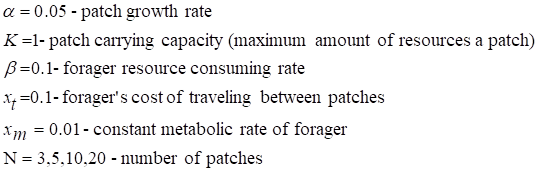

```matlab
function gain = gain(t, alpha, K, beta, xt, xm, N)

% GAIN(t, alpha, K, beta, xt, xm, N) Gain Function

%

% General evaluation of the g(t) function which

% takes in the variables in order: time, patch growth

% rate, patch carrying capacity, consuming rate,

% travel cost, metabolic rate, and number of

% resource patches

rstar = (1 - beta/alpha/N)*K;

deltaBA = beta - alpha;

num = (alpha*rstar + ...

   K*(deltaBA))*exp(deltaBA*t) - ...

   alpha*rstar;

denom = K*deltaBA;

inLog = num/denom;

gain = (beta*K/alpha)*(log(inLog) - deltaBA*t) - ...

 (xt + xm*t);

function intakeRate = r(t, alpha, K, beta, xt, xm, N)

% R(t, alpha, K, beta, xt, xm, N) Intake Rate Function

%

% Calculates the net intake rate. Takes in the variables

% in order: time, patch growth rate, patch carrying

% capacity, consuming rate, travel cost, metabolic rate,

% and number of resource patches

g = gain(t, alpha, K, beta, xt, xm, N);

intakeRate = g./t;

function gainprime = gainprime(t, alpha, K, beta, xt, xm, N)

% GAINP(t, alpha, K, beta, xt, xm, N) Gain Function Derivative

%

% General evaluation of the g'(t) function

%

% Takes in the variables in order: time, patch growth

% rate, patch carrying capacity, consuming rate,

% travel cost, metabolic rate, and number of

% resource patches

rstar = (1 - beta/alpha/N)*K;

deltaBA = beta - alpha;

exppart = (alpha*rstar + K*deltaBA)*exp(deltaBA*t);

num = deltaBA*exppart;

denom = exppart - alpha*rstar;

gainprime = (beta*K/alpha) * (num./denom - deltaBA) - xm;

function rootfunc = rootfunc(t, alpha, K, beta, xt, xm, N)

% ROOTFUNC(t, alpha, K, beta, xt, xm, N) Root Function

%

% This function the one we want to find the root of

% Takes in the variables in order: time, patch growth

% rate, patch carrying capacity, consuming rate,

% travel cost, metabolic rate, and number of

% resource patches

gp = gainprime(t, alpha, K, beta, xt, xm, N);

g = gain(t, alpha, K, beta, xt, xm, N);

rootfunc = gp - g./t;

function rootprime = rootprime(t, alpha, K, beta, xt, xm, N)

% ROOTPRIME(t, alpha, K, beta, xt, xm, N) Root Function Derivative

%

% General evaluation of the rootfunc'(t)

%

% Takes in the variables in order: time, patch growth

% rate, patch carrying capacity, consuming rate,

% travel cost, metabolic rate, and number of

% resource patches

rstar = (1 - beta/alpha/N)*K;

deltaBA = beta - alpha;

exppart = (alpha*rstar + K*deltaBA)*exp(deltaBA*t);

gpp = (beta*K/alpha*(deltaBA^2)*exppart) .* ...

 (-alpha*rstar./(exppart - alpha*rstar).^2);

gp = gainprime(t, alpha, K, beta, xt, xm, N);

g = gain(t, alpha, K, beta, xt, xm, N);

rootprime = gpp - (gp.*t - g)./t.^2;

function ga = ga()

% GA Graphical Analysis of Root and Intake functions

%

% Plots graphs of the intake and root functions

% for N = 3, 5, 10, 20 and selected t intervals

close all;

% Parameter settings

alpha = 0.05; beta = 0.1;

xt = 0.1; xm = 0.01;

K = 1;

% Plotting Intake function

t = linspace(1.3, 40, 300);

w = r(t, alpha, K, beta, xt, xm, 3);

x = r(t, alpha, K, beta, xt, xm, 5);

y = r(t, alpha, K, beta, xt, xm, 10);

z = r(t, alpha, K, beta, xt, xm, 20);

N = [3 5 10 20];

plot(t,w,'-',t,x,':',t,y,'-.',t,z,'--');

title('Intake Rate vs. Residence Time')

xlabel('Residence Time'); ylabel('Intake Rate')

legend('N = 3','N = 5','N = 10','N = 20');

% Plotting Root function

figure;

t = linspace(4, 20, 300);

w = rootfunc(t, alpha, K, beta, xt, xm, 3);

x = rootfunc(t, alpha, K, beta, xt, xm, 5);

y = rootfunc(t, alpha, K, beta, xt, xm, 10);

z = rootfunc(t, alpha, K, beta, xt, xm, 20);

z1 = rootprime(t, alpha, K, beta, xt, xm, 3);

z2 = rootprime(t, alpha, K, beta, xt, xm, 5);

z3 = rootprime(t, alpha, K, beta, xt, xm, 10);

z4 = rootprime(t, alpha, K, beta, xt, xm, 20);

plot(t,w,'-',t,x,':',t,y,'-.',t,z,'--',t,0,'-',t,z1,t,z2,t,z3,t,z4);

title('Root Function')

xlabel('Residence Time'); ylabel('Objective Function')

legend('N = 3','N = 5','N = 10','N = 20');
```

This last function produces two plots that can be used for graphical analysis (shown on next page). One shows the intake rate as a function of time for N = 3, 5, 10, and 20 resources patches. From the first graph, we can confirm that r(t), for different values of N, does indeed have a maximum and the downward sloping nature after the maximum confirms the negative acceleration of the gain function as time passes. The second graph is informative in showing rootfunc(t) and provides an interval of [4, 16] where all the roots of the function are contained for the different N. An additional plot of rootfunc'(t) (although not labeled but are shown as upward sloping curves below the root function) ensures that the interval Newton root finding algorithm will work since not only is rootfunc'(t) < 0, but 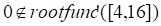 and it turns out that further plotting shows that rootfunc'(t) does not assume a 0 until much later (around t = 40) for t > 0 and different N values.

**3.1.2 Optimization and Analysis**

 With information from the previous section, we can now proceed to fixed-point and interval root finding with confidence that rootfunc(t) is well behaved for the chosen algorithms and that optimal residence times exist. The following code implements the bisection method by Van Loan and fixed-point root finding which uses the same parameter specifications as in the graphical analysis (280-281).

```matlab
function root = Bisection(a, b, alpha, K, beta, xt, xm, N)

% BISECTION(a, b) Bisection Root Finder

%

% Algorithm based on Bisection method by Van Loan (pg. 281)

% a and b define a bracketing interval that contains a root

% of the function rootfunc while other parameters are passed

% into rootfunc

%

% Convergence is set so that tolerance is never smaller than

% than the spacing between the floating point numbers a and b

fa = rootfunc(a, alpha, K, beta, xt, xm, N);

fb = rootfunc(b, alpha, K, beta, xt, xm, N);

delta = 1/500000;

if fa*fb > 0

 disp('Initial interval is not bracketing.')

 disp('Please choose another interval or check function')

 root = 'Invalid Root';

else

while abs(a-b) > delta+eps*max(abs(a),abs(b))

  mid = (a+b)/2;

  fmid = rootfunc(mid, alpha, K, beta, xt, xm, N);   

  if fa*fmid<=0

  % There is a root in [a,mid].

  b = mid;

     fb = fmid;

  else

     % There is a root in [mid,b].

  a = mid;

  fa = fmid;

  end 

 end

 root = (a+b)/2;

end

function fpoptimize = fpoptimize()

% FPOPTIMIZE Root finding for fixed point function

%

% Finds the fixed point optimal residence time for different

% numbers of resource patches N = 3, 5, 10, 20

% using the bisection method

% Parameter settings

alpha = 0.05; beta = 0.1;

xt = 0.1; xm = 0.01;

K = 1;

% Search interval

a = 4; b = 16;

roots = zeros(4,1); i = 1;

N = [3 5 10 20];

for j = N

 roots(i) = Bisection(a, b, alpha, K, beta, xt, xm, j);

 i = i + 1;

end

disp('Resource Patches Optimal Residence Time')

disp('========================================')

for i = 1:4

 disp(sprintf(' %2.0f    %5.10f', N(i), roots(i)))

end

The last function provides us with the following output:

Resource Patches  Optimal Residence Time

============================

 3    12.9525649548

 5    8.4218761921

 10    6.7857687473

 20    6.2008125782

This table of results and can combined with the graphical analysis to produce a graph of the intake function and a spline interpolated plot of optimal residence times t*'s and r(*t)'s for different N.

function ga = gawmax()

% GA Graphical Analysis of Root and Intake functions

%

% Plots graphs of the intake and root functions

% for N = 3, 5, 10, 20 and selected t intervals

% as well as spline interpolant curve of optimal

% residence times on intake plot

close all;

% Parameter settings

alpha = 0.05; beta = 0.1;

xt = 0.1; xm = 0.01;

K = 1;

% Plotting Intake function

t = linspace(1.3, 40, 300);

w = r(t, alpha, K, beta, xt, xm, 3);

x = r(t, alpha, K, beta, xt, xm, 5);

y = r(t, alpha, K, beta, xt, xm, 10);

z = r(t, alpha, K, beta, xt, xm, 20);

N = [3 5 10 20];

for i = 1:4

 roots(i) = Bisection(4, 16, alpha, K, beta, xt, xm, N(i));

 ft(i) = r(roots(i), alpha, K, beta, xt, xm, N(i));

end

maxt = linspace(roots(1), roots(4)-2);

maxr = spline(roots, ft, maxt);

plot(t,w,'-',t,x,':',t,y,'-.',t,z,'--',maxt,maxr);

title('Intake Rate vs. Residence Time')

xlabel('Residence Time'); ylabel('Intake Rate')

legend('N = 3','N = 5','N = 10','N = 20','Optimal Residence Times');
```

This graphical result represents a holistic view of the fixed-point optimization of the r(t) function. In the graph, we see the optimal residence time curve, which illustrates the marginal value theorem since the interpolant intersects the r(t) functions at their maximums. We can use this interpolant to estimate optimal residence times for N > 20 and visualize how these times vary with N. The relation is that as N increases from 3 the optimal residence time in a patch decreases. This result makes sense from the model since more patches imply higher average intake rates and therefore but the marginal value theorem, a forager will tend to move to different patches more quickly to optimize its resource consumption. When looking at results in the next section on IA, we should take with us the fixed-point optimal times as well as the bisection method's initializing interval of [4,16] which can be used to initiate the interval Newton method.

**3.2 Interval Analysis**

**3.2.1 True Solutions and Interval Optimization**

 During the interval optimization, we will simulate fixed-point optimization first using crisp intervals for the parameters and then conduct interval optimization by varying the parameters as outlined in section 2.1.3 to obtain interval optimal residence times. The following is code implementing the creation of a new interval data structure, the interval Newton algorithm, and the united extension Newton step.

```matlab
function newInterval = newInterval(c, p)

% NEWINTERVAL Interval creator

%

% Creates a new interval given a centerpoint c and

% a percentage uncertainty p

p_uncert = p/100;

inf = c -- p_uncert*absI;

sup = c + p_uncert*absI;

newInterval = infsup(inf, sup);

function root = intNewton(x, alpha, K, beta, xt, xm, N, nEvalsMax)

% INTNEWTON(a, b) Interval Root Finder

%

% Algorithm based on Interval Newton method by Kulisch (pg. 35-37)

% x defines a bracketing interval that contains a root

% of the function rootfunc while other parameters are passed

% into rootfunc

%

% Convergence based on nvalsMax (maximum number of iterations)

% since we do not know the optimal residence interval size

fx = rootfunc(x, alpha, K, beta, xt, xm, N);

if 0 < inf(fx) | 0 > sup(fx)

 disp('Initial interval is not bracketing.')

 disp('Please choose another interval or check function')

 root = 'Invalid Root';

else

 I = 0;

 while I < nEvalsMax

 x = UnitedNewtonStep(x, alpha, K, beta, xt, xm, N);

 I = I + 1;

 end

 root = x;

end

function x = UnitedNewtonStep(x, alpha, K, beta, xt, xm, N)

% UNITEDNEWTONSTEP United Extension implementation of Newton Step

% Since we have 5 variables that are intervals, there will be

% 32 combinations of interval endpoints to compute for

% the derivative quantity and 16 combinations for the

% function quantity (16 because xmid is a crisp interval)

midx = mid(x);

% Various endpoints

a = inf(x);  b = sup(x);

c = inf(alpha); d = sup(alpha);

e = inf(beta);  f = sup(beta);

g = inf(xt);  h = sup(xt);

I = inf(xm);  j = sup(xm);

num = zeros(16,1); denom = zeros(25,1);

I = 1;

j = 1;

for alpha = [c d]

 for beta = [e f]

 for xt = [g h]

 for xm = [I j]

 num(i) = rootfunc(midx, alpha, K, beta, xt, xm, N);

 I = I + 1;

 for xval = [a b]

 denom(j) = rootprime(xval, alpha, K, beta, xt, xm, N);

 j = j + 1;

 end

 end

    end

 end

end

unitedNum = infsup(min(num), max(num));

unitedDenom = infsup(min(denom), max(denom));

comp = midx -- unitedNum/unitedDenom;

x = intersect(comp, x);

function intoptimize = intoptimize()

% INTOPTIMIZE Root finding for Interval function

%

% Finds the optimal residence interval for different

% numbers of resource patches N = 3, 5, 10, 20

% using the Interval Newton Method

% Parameter settings

alpha = newInterval(0.05, 0); beta = newInterval(0.1, 0);

xt = newInterval(0.1, 0); xm = newInterval(0.01, 0);

K = 1;

% Search interval

searchInt = infsup(4, 16);

N = [3 5 10 20];

roots = cell(4,1); I = 1;

for I = 1:4

 roots{I} = intNewton(searchInt, alpha, K, beta, xt, xm, N(i), 100);

end

disp('Resource Optimal Residence Time F-P Approx')

disp(' Patches')

disp('========================================================')

for I = 1:4

 a = inf(roots{I}); b = sup(roots{I});

 midab = mid(roots{I});

 disp(sprintf([' %2.0f [%2.10f, %2.10f]' ...

 ' %2.10f'],N(i),a,b,midab))

end
```

The last function with zero uncertainty in the parameters produces the following results:

```txt
Resource  Optimal Residence Time   F-P Approx

 Patches

 3  [12.9525651169, 12.9525651169]  12.9525651169

 5  [8.4218760246, 8.4218760246]  8.4218760246

 10  [6.7857683450, 6.7857683450]  6.7857683450

 20  [6.2008119626, 6.2008119626]  6.2008119626
```

Given the following parameter uncertainties:


and a change in the starting interval to [2,20], using the intoptimize function the results are:

```txt
Resource  Optimal Residence Time     F-P Approx

 Patches

=====================================

 3  [11.0019636898, 16.3308126324]  13.6663881611

 5  [6.5135558910, 10.9632700610]  8.7384129760

 10     [3.3884949151, 10.1319917480]  6.7602433315

 20  [2.6720528558, 9.6782749976]  6.1751639267
```

The significance of these results will be explored in chapter 4.

**3.2.2 Stability Analysis**

 The stability analysis for this model was conducted by gradually increasing the percentage uncertainties from zero. Failure of the model occurs if one of the roots returned during optimization is found to be the same interval as the initial interval [4, 16]. The code implementing stability analysis is not generalized to any parameter, so user changes are made to select the correct variable and initial condition. The code displayed shows stability analysis for alpha. Through testing to speed up the stability analysis, the conditions of increments of two to the percentage uncertainty of a parameter after five Newton iterations are sufficient to produce accurate uncertainties where the model fails.

```matlab
function sa = sa()

% SA Stability Analysis

%

% Finds the optimal residence interval for different

% numbers of resource patches N = 3, 5, 10, 20

% using the Interval Newton Method

% Conducts gradual increase in uncertainty of a given

% parameter until at least of the roots returned is the

% initial interval with 5 Newton iterations

% Parameter settings

alpha = newInterval(0.05, 0); beta = newInterval(0.1, 0);

xt = newInterval(0.1, 0); xm = newInterval(0.01, 0);

K = 1;

% Search interval

searchInt = infsup(4, 16);

N = [3 5 10 20];

p = 0; inc = 2; stop = 0;

while stop ~= 1

 % Choose parameter to increment percent uncertainty

 p = p + inc;

 alpha = newInterval(0.05, p);

 for i = 1:4

 root = intNewton(searchInt, alpha, K, beta, xt, xm, N(i), 5);

 size = sup(root) - inf(root);

 if size == 12

 stop = 1;

 Nstop = N(i);

 end

 end

end

a = inf(alpha); b = sup(alpha);

disp(sprintf('Model Failure at N = %2.0f', Nstop))

disp(sprintf('For parameter alpha with value [%5.7f, %5.7f]',a,b))

disp(sprintf('with percentage uncertainty: %3.0f',p));
```

The results for the 4 parameters are:

Model Failure at N = 5

For parameter alpha with value [0.0280000, 0.0720000]

with percentage uncertainty: 44

Model Failure at N = 5

For parameter beta with value [0.0620000, 0.1380000]

with percentage uncertainty: 38

Model Failure at N = 5

For parameter xt with value [0.0440000, 0.1560000]

with percentage uncertainty: 56

I was not able to find a percent uncertainty for xm that caused the model to fail even using different starting p values and small increments. However, the other parameters yielded failures at quite high percentages.

### Chapter 4: Conclusions and Future Exploration

**4.1 Results of Numerical Study**

**4.3.1 Comparison of Fixed-Point and Interval Roots**

The values obtained from both optimization methods corresponded well since there was only O(10^-6) error between the results. This error bound was derived from the error between the fixed-point roots and the endpoints of the optimal residence time intervals and the error can also be seen since the interval approximations and fixed-point roots correspond up to the 5^th^ decimal place. Therefore, simulating fixed-point optimization using interval techniques yielded a satisfactory approximation.

**4.2.3 Applications to Foraging Model**

 This section can be considered as conclusions to the research problem as well as the overall implications of IA to the simplistic analytic foraging model. The use of IA to simulate different parameter states into the system was successful since the percent uncertainties yielded interval optimal residence times. As a result, IA allows the ecologist to vary parameters of the model within certain limitations established by stability analysis and obtain a range of optimal residence times a forager might choose. The percent uncertainty limitations on parameter variation obtained from the stability analysis are high, which is good since it allows a large amount of model variability. However, we should keep in mind the stability analysis was made varying one variable at a time. Repeating the results from section 3.2.1, this time with percent uncertainties matching the fixed-point approximations, we obtain:

Resource Optimal Residence Time  F-P Approx Percent

```txt
 Patches Uncertainty

==================================================== 

 3      [11.0019636898, 16.3308126324]  13.6663881611  19.49619

 5      [6.5135558910, 10.9632700610]  8.7384129760  25.46065

 10      [3.3884949151, 10.1319917480]  6.7602433315  49.87614

 20      [2.6720528558, 9.6782749976]  6.1751639267  56.72904
```

which provide us with just a sample of IA's capabilities in analyzing the model. IA's applications to the foraging model include adding more realism to the model through deterministic variability as well as allowing the ecologist to select which parameters are to be uncertain, their range, or different beginning time intervals. The variability is important due to the sometimes stochastic nature of ecological process and IA offers an alternative to average state approximations. As stated by Stephen and Krebs, foraging models sometimes run into problems when assuming constant animal metabolic rates or equilibrium resources (34). Therefore, IA allows the model to address some of the problems involved in fixed-point optimization and have the potential to provide a characterization of experimental values for residence times by bounding them.

4.2 Future Exploration

 The applications of increased testability, parameter variation, and interval optimization provided by IA to our foraging model can easily be applied to other deterministic models in behavioural ecology. This fact is especially true for optimality models where average values do not approximate well the range of states taken on by the environment or animal. Also, although not covered in this paper, IA has applications to multivariable global optimization due to it's strength in evaluating multiple ranges of values which can be applied in a Newton like algorithm (see Hansen in references). An immediate extension of the work done on this paper involves Wilson's Forager Simulation Model and extensions for multi foragers (161, 178). The two models are simulations through time of foragers consuming resources in a set of patches and involve a bit more forager/patch dynamic analysis and integration of additional foragers into the model.

**Bibliography**

Hart, John C. "Ray Tracing Implicit Surfaces." Notes for Advanced Surface Modeling.

<http://graphics.cs.uiuc.edu/~jch/cs497jch/rtis.pdf> (8 Nov. 2001).

Hansen, E. R. "Global Optimization Using Interval Analysis: The One-Dimensional Case" Journal of Optimization Theory and Applications **29** (1979): 331-344.

Krebs, John R. and N. B. Davies. An Introduction to Behavioural Ecology. 2nd ed. Sunderland: Sinauer Associates, Inc., 1987.

Kulisch, U., R. Lohner, and A. Facius., eds. Perspectives on Enclosure Methods. New York: Springer-Verlag, 2001.

Moore, Ramon E. Interval Analysis. Englewood Cliffs: Prentice-Hall, Inc. 1966.

Neumaier, Arnold. Interval Methods for Systems of Equations. New York: Cambridge University Press, 1990.

Rice, John R. Numerical Methods, Software, and Analysis. 2nd ed. New York: Academic Press, Inc., 1993.

Rump, Siegfried M. "INTerval LABoratory Version 3." INTLAB

<http://www.ti3.tu-harburg.de/~rump/intlab/index.html> (14 Dec. 2001).

Schwartz, David I. Deterministic Interval Uncertainty Methods for Structural Analysis. Diss. State University of New York at Buffalo, 1999.

Stephens, David W. and John R, Krebs. Foraging Theory. Princeton: Princeton University Press, 1986).

Van Loan, Charles. Introduction to Scientific Computing. 2nd ed. Upper Saddle River: Prentice Hall 2000.

Wilson, Will. Simulating Ecological and Evolutionary Systems in C. Cambridge: Cambridge University Press, 2000.